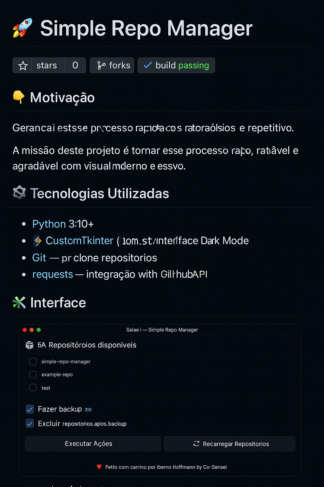

# 🚀 Simple Repo Manager


---

🎯 Automatize o backup completo dos seus repositórios GitHub com segurança, estilo e um toque de carinho. O Simple Repo Manager permite clonar, zipar e excluir repositórios diretamente da sua conta — com interface visual e personalizável.

---

## 🖼️ Preview



---

## 💡 Por que?

> “Era muito trabalhoso fazer isso um a um no GitHub...”  
> — *Iberno Hoffmann*

Esse app nasceu de uma dor real: facilitar o backup, organização e limpeza de repositórios no GitHub. Agora, com um clique e um sorriso, você tem controle total.

---

## 🛠️ Feito com

- **Python 3.10+**
- [CustomTkinter](https://github.com/TomSchimansky/CustomTkinter)
- `requests`, `subprocess`, `shutil`
- Interface com Dark Mode 💙

---

## 🎮 Como usar

1. Clone este repositório
2. Instale as dependências:

```bash
pip install customtkinter requests
